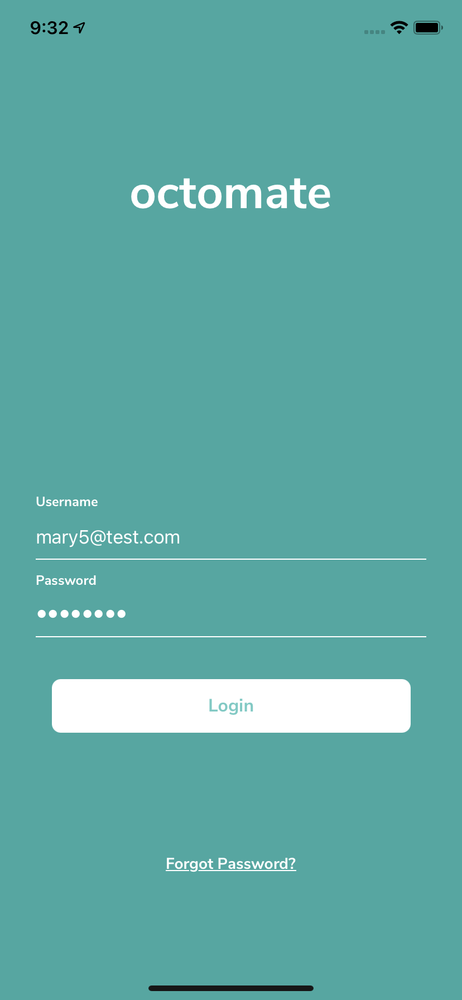
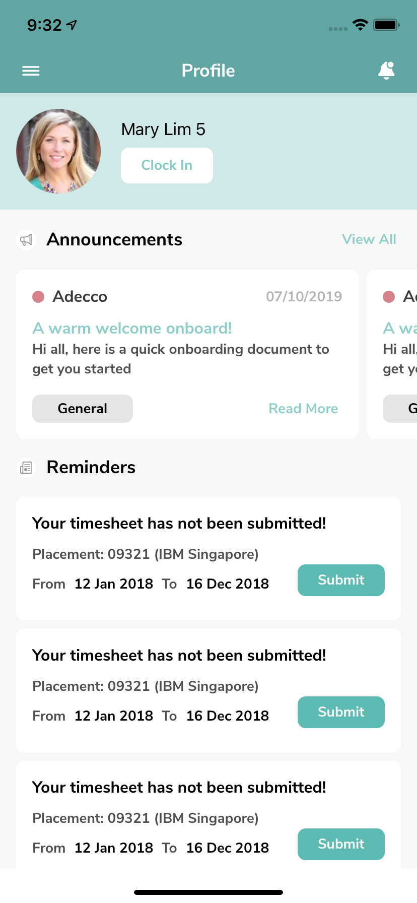
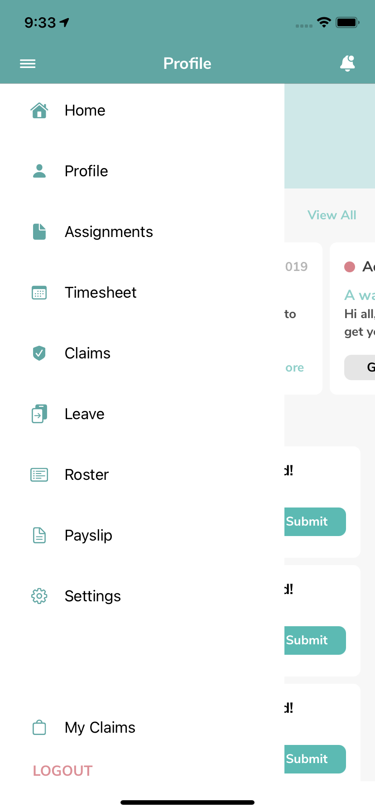
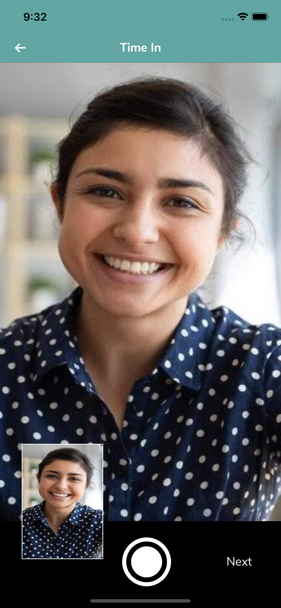
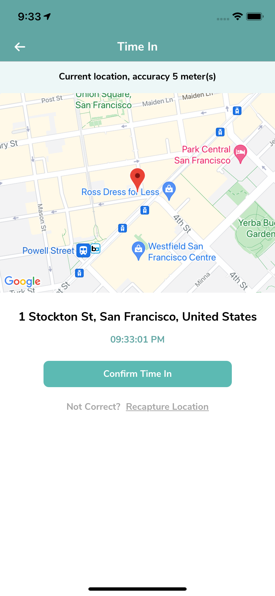
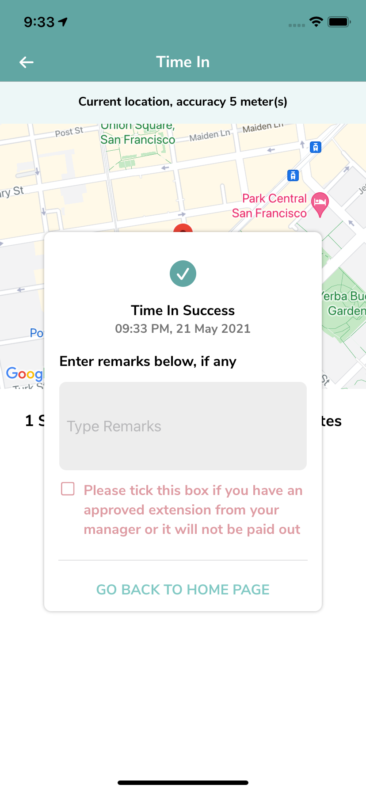
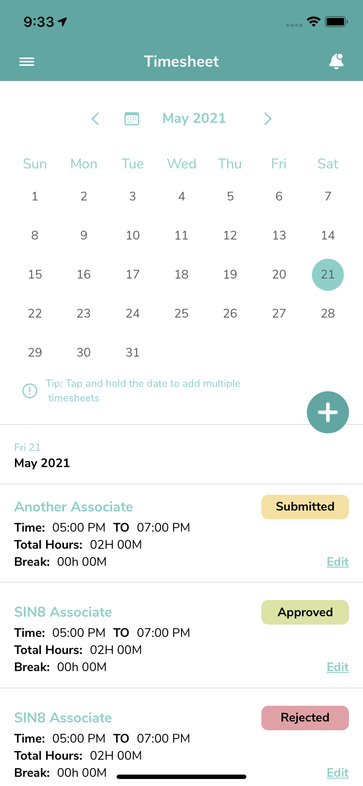

# Octomate Prototype

## Screenshots

<p float="left">
  
   
  
  
  
  
  
</p>

## Getting Started

These instructions will get you a copy of the project up and running on your local machine for development and testing purposes. See deployment for notes on how to deploy the project on a live system.

### Prerequisites

* Xcode 12.4 or latest

### Installing

```
1. Clone or download this project
2. Open terminal and head to root project
3. Run $ pod install in your project directory and wait until it finishes
4. Open App.xcworkspace using Xcode and build
5. Replace API_KEY value on Octomate-Info.plist with your own Google Maps API Key
6. Run using an iOS Simulator or real device (Tested on iOS Simulator 11.4)
```

## Built With

* SwiftUI
* Google Maps
* Alamofire
* Alamofire Network Activity Logger
* MVVM architectural pattern

### Issue

* No camera feature on TimeInSelfieView screen to avoid app force close as I do not have an iOS device to test

## Author

Prima Santosa - mauliawan@primasantosa.com

## License
This project is licensed under the MIT License - see the [LICENSE](LICENSE) file for details
